# What is an IP Address?

> An IP Address (Internet Protocol Address) is a unique numerical label assigned to each device connected to a computer network that uses the Internet Protocol for communication.

## It serves two main purposes:

- Identifying a device on the network.
    
- Locating the device to enable communication with other devices over a network like the Internet.
    

> **Note:** In simple terms, an IP address acts like a digital home address, allowing data to be sent and received between devices correctly.

---

# Components of an IP Address

## Network Portion

- Identifies the network to which the device belongs.
    

## Host Portion

- Identifies the individual device on the network.
    

## Subnet Mask (for IPv4)

- Defines which part of the IP is network and which part is host.
    

### Example

```text
IP Address : 192.168.1.10
Subnet Mask: 255.255.255.0

Network ID : 192.168.1.0
Host ID    : 10
```

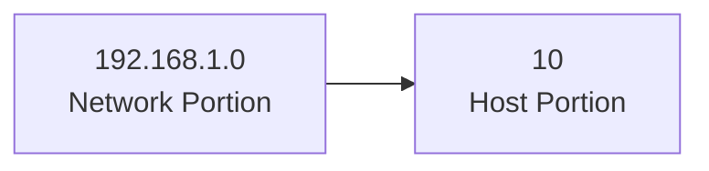

---

# Types of IP Address

## 1. Based on Addressing Scope (IPv4 vs. IPv6)

### 1.1 Public IP Addresses

- A Public IP address is assigned to every device that directly accesses the internet.
    
- This address is unique across the entire internet.
    
- Uniqueness & Accessibility are its key characteristics & are assigned by Internet Service Providers.
    
- When you connect to the internet through an ISP, your device or router receives a public IP address.
    
- These addresses can be static or dynamic.
    

#### Example Use

- If you host a website on your own server at home, your ISP must assign a public IP address to your server so users around the world can access your site.
    

---

### 1.2 Private IP Addresses

- Private IP addresses are used within private networks and are not routable on the internet.
    
- This means that devices with private IP addresses cannot directly communicate with devices on the internet without a translating mechanism like a router performing Network Address Translation (NAT).
    
- These are only required to be unique within their own network.
    
- Used for communication between devices within the same network.
    

#### Defined ranges for IPv4

```text
10.0.0.0       - 10.255.255.255
172.16.0.0     - 172.31.255.255
192.168.0.0    - 192.168.255.255
```

#### Defined ranges for IPv6

```text
Addresses starting with FD or FC
```

#### Example Use

- In a typical home network, the router assigns private IP addresses to each device.
    
- The router uses NAT to allow these devices to access the internet using its public IP address.
    

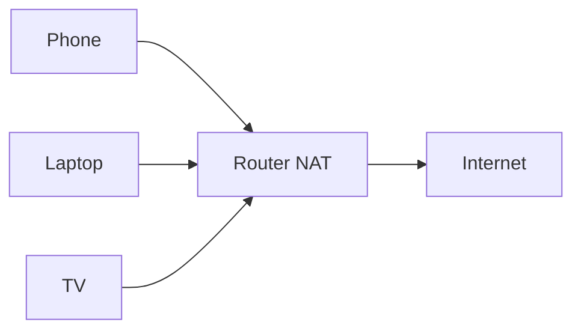

---

# 2. Based on IP Version

## 2.1 IPv4

- This is the most common form of IP Address.
    
- It consists of four sets of numbers(octets) separated by dots.
    
- This format can support over 4 billion unique addresses.
    

### Example of IPv4 Address

```text
192.168.1.1
```

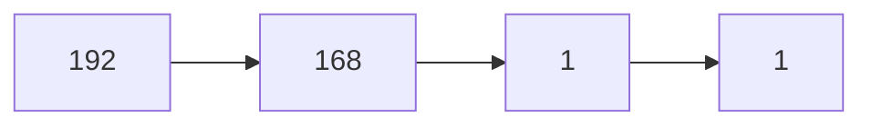

---

## 2.2 IPv6

- IPv6 addresses were created to deal with the shortage of IPv4 addresses.
    
- They use 128 bits instead of 32.
    
- These addresses are expressed as eight groups of four hexadecimal digits.
    

### Example of IPv6 Address

```text
2001:0db8:85a3:0000:0000:8a2e:0370:7334
```

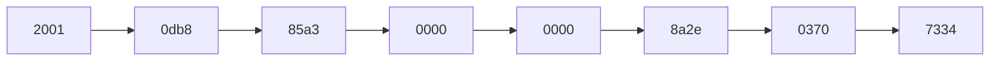

---

# 3. Based on Assignment

## 3.1 Static IP Addresses

- Permanently assigned to a device.
    
- Typically important for servers or devices that need a constant address.
    
- Reliable for network services that require regular access such as websites, remote management.
    

## 3.2 Dynamic IP Addresses

- Temporarily assigned from a pool of available addresses by the Dynamic Host Configuration Protocol (DHCP).
    
- Cost-effective and efficient for providers.
    

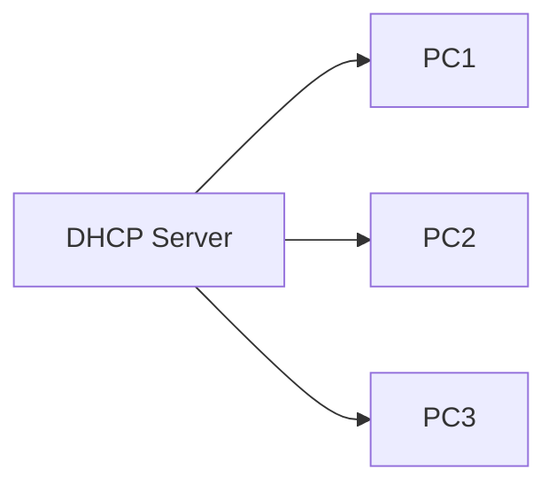

---

# 4. Based on Function

## 4.1 Unicast Address

- One-to-one communication.
    

### Example

- Sending an email or loading a webpage.
    


---

## 4.2 Broadcast Address

- One-to-all communication within a network.
    

### Example

- ARP request.
    

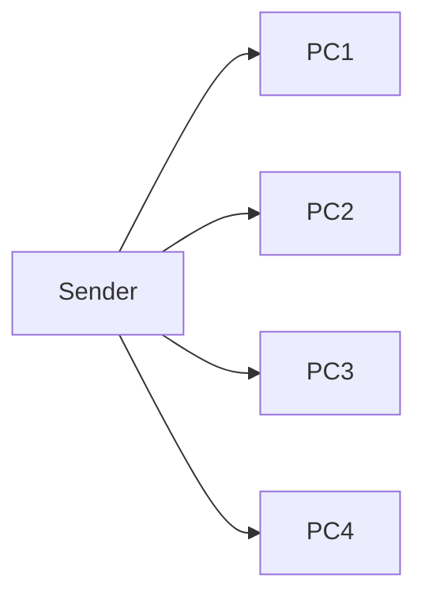

---

## 4.3 Multicast Address

- One-to-many (selected group) communication.
    

### Example

- IPTV, video conferencing, live streaming.
    

#### IPv4 Range

```text
224.0.0.0 to 239.255.255.255
```

#### IPv6 Prefix

```text
FF00::/8
```

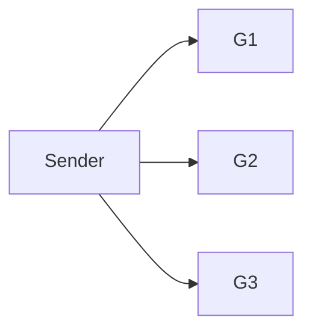

---

## 4.4 Anycast Address

- One-to-nearest communication (based on routing distance).
    

### Example

- DNS servers, CDN routing, load balancing.
    

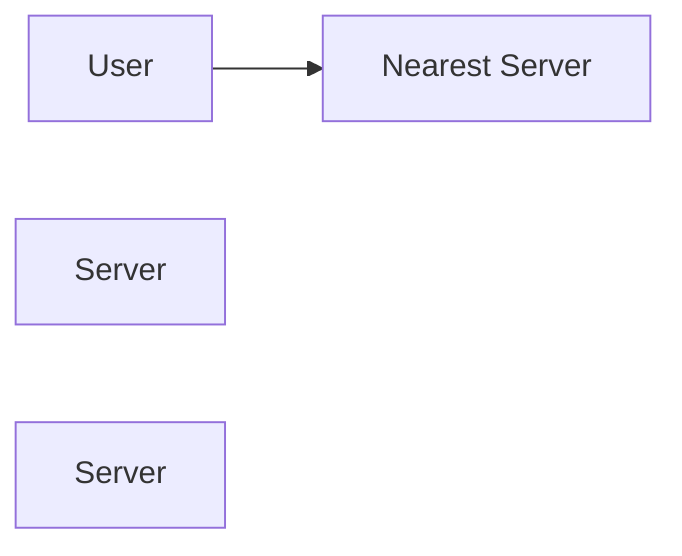

---

# Classes of IPv4 Address

|IP Class|Address Range|Maximum number of networks|
|---|---|---|
|Class A|1-126|126 (2⁷-2)|
|Class B|128-191|16384|
|Class C|192-223|2097152|
|Class D|224-239|Reserve for multitasking|
|Class E|240-254|Reserved for Research and development|

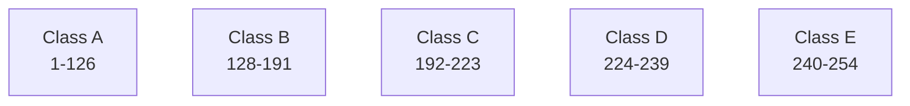

---

# Special IP Addresses

## Loopback Address

```text
127.0.0.1
```

- Used to test network connectivity within the same device.
    
- Often called "localhost."
    

## Broadcast Address

```text
192.168.1.255
```

- Allows data to be sent to all devices in a network.
    

## Multicast Address

```text
233.0.0.1
```

- Used to send data to a group of devices.
    

---

# How Do IP Addresses Work?

## 1. Unique Identification

- Every device connected to a network is assigned an IP address.
    
- Acts like a digital home address.
    

## 2. Communication Protocol

Each packet contains:

- The source IP address.
    
- The destination IP address.
    


## 3. Data Routing

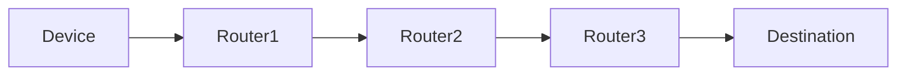

## 4. LAN and WAN Communication

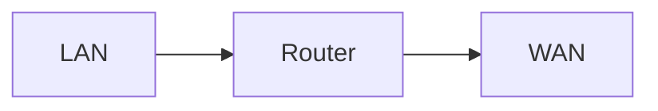

## 5. Network Address Translation (NAT)

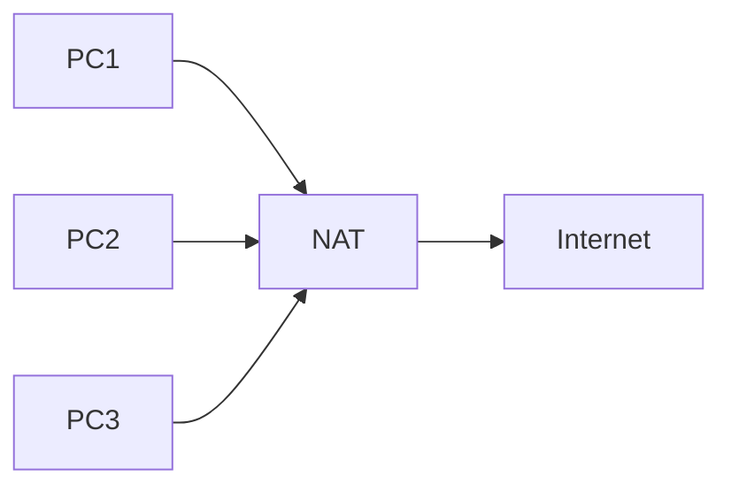

---

# Real World Scenario: Sending an Email from New York to Tokyo

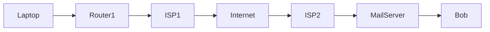

### Steps

1. Assigning IP Addresses
    
2. Connecting to the Internet
    
3. Sending the Email
    
4. Routing the Packets
    
5. Reaching Bob
    
6. Email Retrieval
    

---

# How to Look Up IP Addresses?

## 1. In Windows

```cmd
ipconfig
```

## 2. On Mac

```text
System Preferences > Network
```

## 3. On iPhone

```text
Settings > Wi-Fi
Tap (i)
```

---

# IP Address Security Threats

## IP Spoofing

- Attackers fake a trusted IP address.
    

## DDoS Attacks

- Multiple infected systems flood a target.
    

## Man-in-the-Middle (MitM)

- Hackers intercept or alter data.
    

## Port Scanning

- Attackers scan for open ports.
    

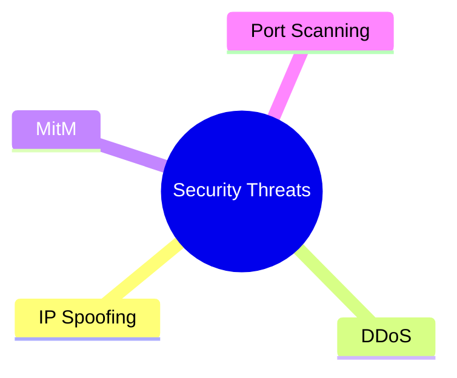

---

# How to Protect and Hide Your IP Address

## Use a VPN (Virtual Private Network)

## Use a Proxy Server

## Use the Tor Browser

## Enable a Firewall

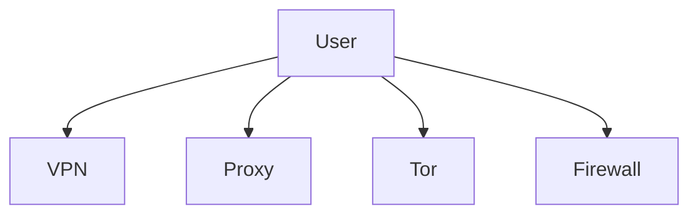