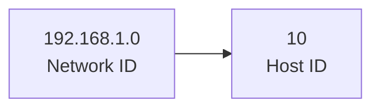
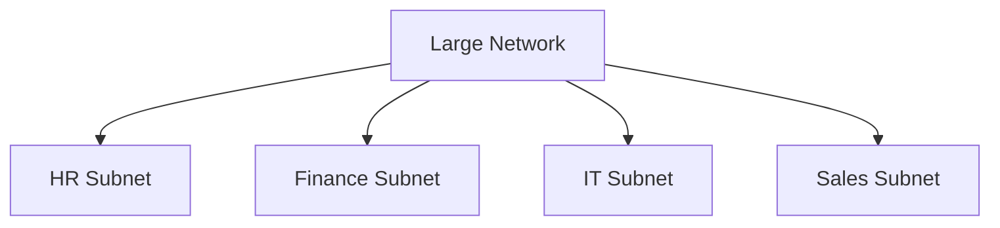

> A subnet mask is a 32-bit number used with an IP address to divide it into two parts:

- the network ID and
- the host ID.

In a subnet mask:

- Binary 1s represent the **network portion** of the IP address.
- Binary 0s represent the **host portion**.

The subnet mask helps a device determine whether another device is on the same local network or on a different network, which in turn decides whether communication is direct or must go through a router.

---

## Example

```text
IP Address  : 192.168.1.10
Subnet Mask : 255.255.255.0

Network ID  : 192.168.1.0
Host ID     : 10
```



---

## Function of Subnet Mask

- Separates an IP address into network ID and host ID.
- Divides a large network into smaller subnets for better organization.
- Improves network efficiency, security, and manageability by reducing unnecessary traffic.
- Helps routers determine whether a packet should be forwarded locally or to another network.

---

## Why Use a Subnet Mask?

Consider a Class A network, which can support approximately 16 million hosts.

### Problems

- Maintenance becomes difficult due to the large number of connected devices.
- Security risks increase, as all devices share the same network.
- Large broadcast domains reduce efficiency.

### Solution: Subnetting

Subnetting addresses these issues by dividing a large network into smaller, manageable sub-networks called subnets using a subnet mask.

Benefits:

- Improves security by isolating departments.
- Enhances network efficiency by reducing unnecessary traffic.
- Simplifies network management.



---

## Address Identification

### Without Subnetting

1. Identification of the network
2. Identification of the host
3. Identification of the process

### With Subnetting

1. Identification of the network
2. Identification of the subnet
3. Identification of the host
4. Identification of the process

---

## Subnetting Example

Suppose we have a Class C network and we want to divide it into 4 subnets.

- Borrow 2 bits from the host part.
- Subnet mask: 255.255.255.192
- Binary: 11111111.11111111.11111111.11000000

```mermaid
flowchart LR
A[/24 Network]
A --> B[/26 Subnet 1]
A --> C[/26 Subnet 2]
A --> D[/26 Subnet 3]
A --> E[/26 Subnet 4]
```

---

## Subnet Matching (Bitwise AND)

```text
IP Address:    200.1.2.20
Subnet Mask:   255.255.255.192

Result:        200.1.2.0
```

Therefore:

```text
200.1.2.20 belongs to subnet 200.1.2.0/26
```

---

## Routing Table and Subnet Matching

- If the network id doesn’t matches with any of the subnet mask then the packet will be sent to default entry.
- Default entry has network id as 0.0.0.0.

### Longest Prefix Match

If the network id matches multiple routing table entries:

- Select the interface having the longest subnet mask (more 1's).

```mermaid
flowchart TD
Packet --> RouteTable
RouteTable --> Match1[/24]
RouteTable --> Match2[/26]
Match2 --> Selected
```

---

## Network Classes

The Internet Assigned Numbers Authority (IANA), through InterNIC, manages the allocation of IP addresses.

### Class Usage

| Class | Purpose |
|---------|---------|
| A | End Users |
| B | End Users |
| C | End Users |
| D | Multicast |
| E | Experimental |

---

## Advantages of Subnetting

- Reduces Congestion
- Efficient IP Usage
- Enhanced Security
- Departmental Segmentation
- Scalable & Organized

---

## Disadvantages of Subnetting

- Fewer Usable Addresses
- Higher Hardware Costs
- Complex Setup
- Compatibility Issues

---

## Related Notes

- [[IP Address]]
- [[OSI Model]]
- [[Routing]]