> Devices that are used to connect multiple devices together to form a network.

Network Devices are the physical appliances required for communication and interaction between computers on a computer network.

---

# Network Devices by OSI Layer

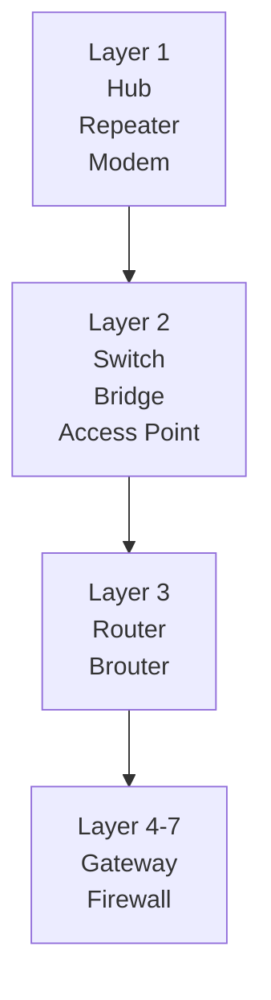

---

# Layer 1 Devices: Physical Layer

> These devices deal with raw electrical or optical signals (bits).

## 1. Hub

>A hub is a simple networking device that allows multiple devices to connect to a network.

- When a device sends data to the hub, the hub broadcasts the data to all connected devices to a network, regardless of whether or not they are the intended recipients.
- dumb; no memory; sends everywhere
- Layer 1 --> physical (just moves electrical signals)

### Diagram

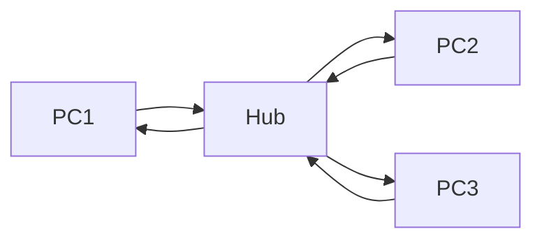

---

## 2. Repeater

> It regenerates signals to extend the range of a network.

- It receives a weak signal (due to attenuation over long cables), amplifies it, and retransmits it.
- Extending WiFi range or Ethernet cables beyond 100 meters.

### Diagram

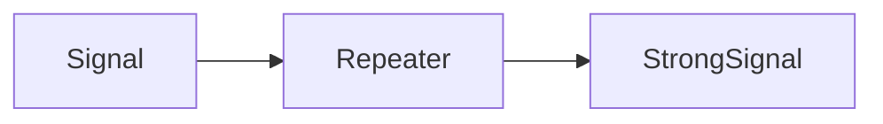

---

## 3. Modem (Modulator-Demodulator)

> This bridges the gap between digital computer data and analog signals.

- Connects your home network to the ISP.
- Converts digital signals into analog signals and vice versa.

### Diagram

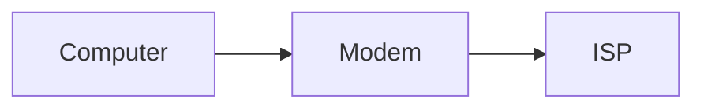

---

# Layer 2 Devices: Data Link Layer

> These devices work with MAC Addresses.

## 4. Switch

>A switch is a more advanced networking device.

- When a device sends data to a switch, the switch analyses the data and forwards it only to the intended recipients.
- This improves network efficiency by reducing network congestion and prevent unnecessary broadcasts.
- smart hub -> learns MAC address.
- Layer 2 --> data link (reads MAC address).

### Diagram

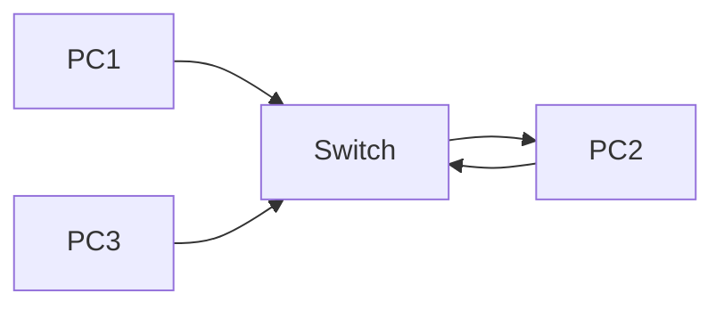

---

## 5. Bridge

> connects two network segments and filter traffic between them.

- Filters traffic based on MAC addresses.
- Largely replaced by Switches.

### Diagram

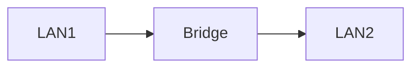

---

## 6. Access Point (AP)

> Allows Wi-Fi enabled devices to connect to a wired network.

- Acts as a bridge between wired Ethernet and wireless Wi-Fi devices.
- Does not route traffic or assign IP addresses.

### Diagram

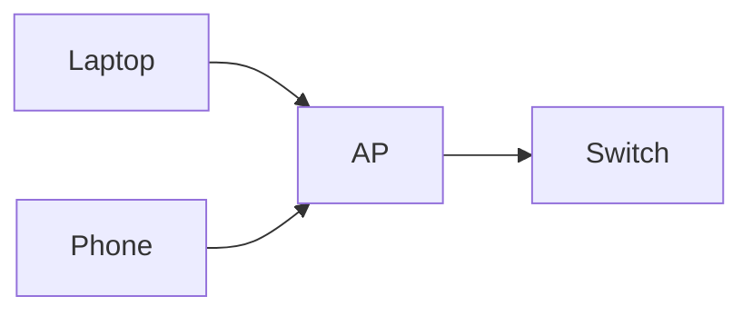

---

# Layer 3 Devices: Network Layer

> These devices work with IP Addresses.

## 7. Router

>A router connects multiple devices together and direct data traffic between them.

- A router uses routing tables to determine the best path of data to take on its way to its destination.
- Routers also provide network security by filtering and blocking unwanted traffic.
- traffic director between networks.
- Layer 3 --> Network (reads IP addresses).

### Diagram

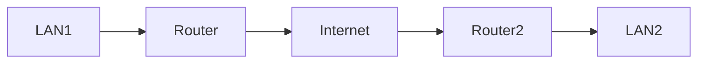

---

## 8. Brouter (Bridging Router)

> Combines bridge and router functions.

- Routes known protocols.
- Bridges unknown protocols.
- Rarely used today.

### Diagram

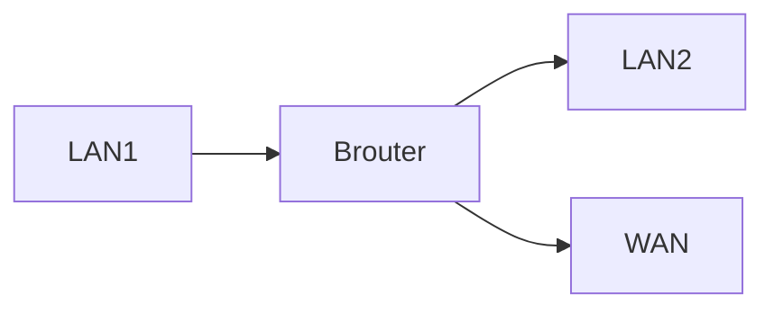

---

# Layer 4-7 Devices: Advanced Processing

## 9. Gateway

> Acts as an entry/exit point between two distinct networks using different protocols.

- Converts protocols, data formats, or architectures.
- Internet Gateway translates private LAN requests into public internet requests.

### Diagram

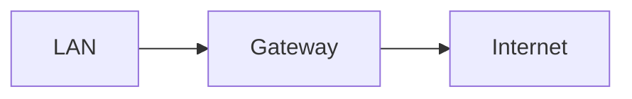

---

## 10. Firewall

> Monitors and controls incoming and outgoing network traffic.

- Hardware or software based.
- Uses predefined security rules.
- Tracks active connections.

### Diagram

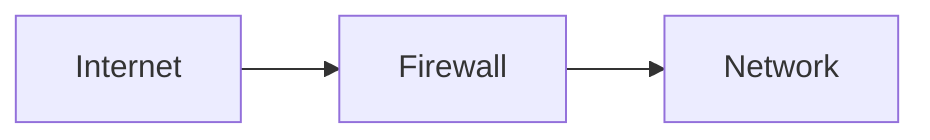

---

# Hub vs Switch vs Router

![[Pasted image 20260614215809.png]]

---

