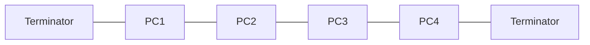
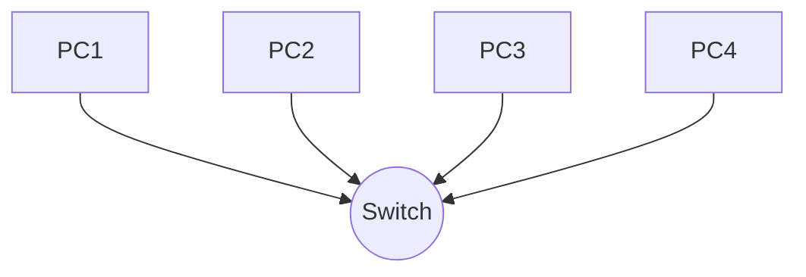
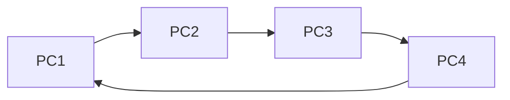
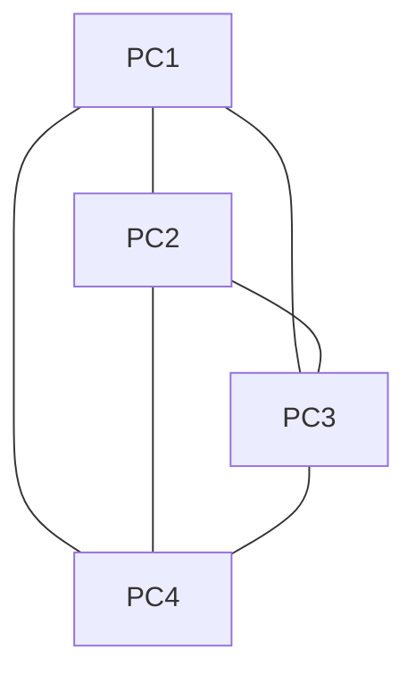
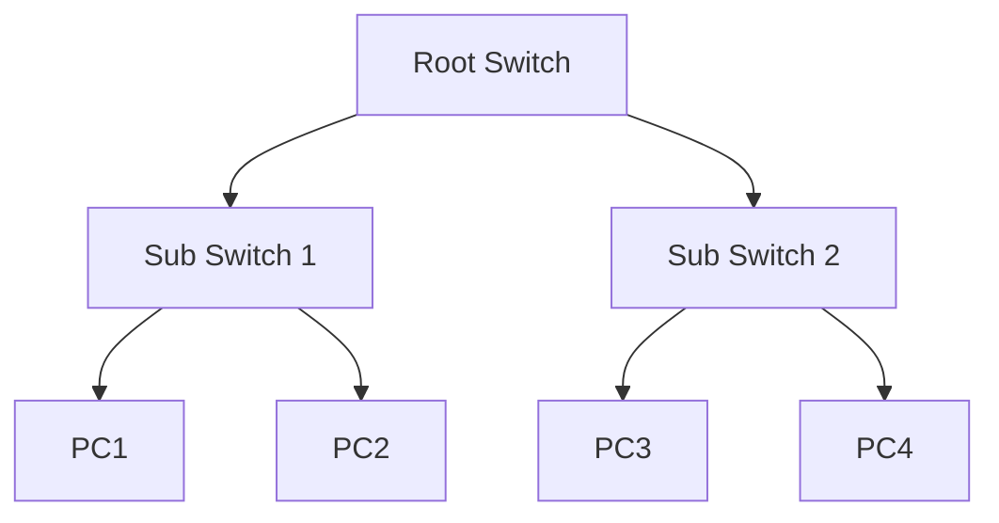
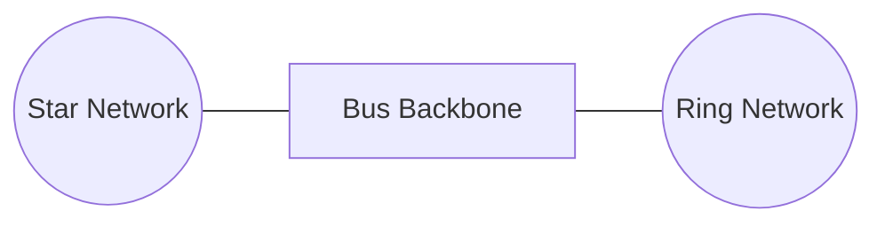

> A topology is the arrangement/layout of devices in a network.

---

# Bus Topology

- All devices share a single central cable called the backbone.
    
- It is bi-directional.
    
- Data is broadcast to every device but only intended device accepts it.
    
- Terminators at both ends prevent signal bounce.
    

### Diagram

```text
[Terminator]---PC1---PC2---PC3---PC4---[Terminator]
                 |
             Backbone
```




---

# Star Topology

- Every device connects directly to a central hub or switch.
    
- All traffic passes through this central point.
    
- Widely used topology today.
    
- In central hub (passive -> to all ) & switch (intelligent -> sends to intended recipient).
    

### Diagram

```text
          PC1
           |
           |
PC2 ---- Switch ---- PC3
           |
           |
          PC4
```




---

# Ring Topology

- Devices are connected in a close loop.
    
- Data travels in one direction around the ring, passing through each device until it reaches the direction.
    
- Uses a token to decide which device can send.
    
- Token passes around ring --> device with token sends data --> passes along unitl it reaches target.
    

### Diagram

```text
      PC1
    /     \
  PC4     PC2
    \     /
      PC3
```




---

# Mesh Topology

- Every device is connected to every other device.
    
- Multiple paths exist between any two nodes.
    
- If one path fails, data automatically reroutes through another.
    
- Extremely reliable; Expensive
    

### Diagram

```text
      PC1
     / | \
    /  |  \
  PC2--|--PC3
    \  |  /
     \ | /
      PC4
```




---

# Tree Topology

- A hierarchieal layout combining star and bus.
    
- A root (central) switch/hub branches into sub switches, which then connect to end devices.
    
- Data travels up/down branches through hierarchy.
    

### Diagram

```text
              Root Switch
             /           \
     Sub Switch 1     Sub Switch 2
        /    \           /     \
      PC1   PC2       PC3     PC4
```




---

# Hybrid Topology

- A combination of two or more toplogies in the same network.
    
- For Eg:- one bldg uses star, another ring, they are linked with a Bus backbone.
    

### Diagram

```text
      Star Network
          |
       Switch
          |
==========Bus Backbone==========
          |
      Ring Network
```




---
