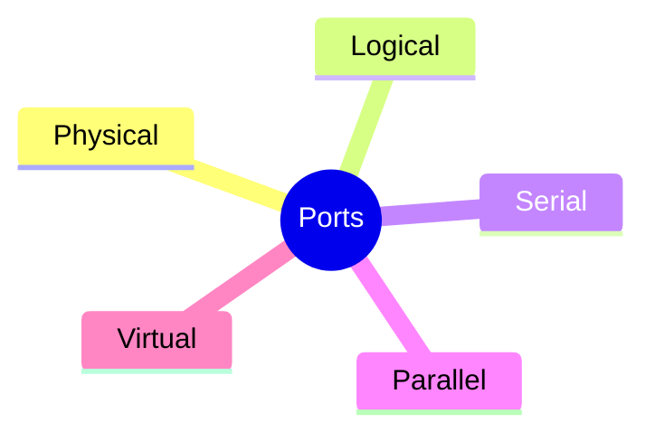

# Ports in Networking

>A port is a logical identifier used to distinguish different applications or services on a device, allowing network traffic to reach the correct program.

## Key Points

- Ports work at the Transport layer, using TCP and UDP to send and receive data between devices.
- They enable multiple applications to use the network simultaneously without interference.
- Ports help the operating system route incoming data to the appropriate application.

---

# How Ports Work

When a device communicates over a network, data packets are sent to its IP address. Each packet also includes a port number, which tells the operating system which application or service should receive that data.

## Key Concepts

- Port numbers identify services: Each application listens on a specific port, so incoming data reaches the correct program.
- IP + Port + Protocol = Socket: This combination ensures that network traffic is delivered precisely to the right process on the right device.
- TCP and UDP protocols use ports differently: TCP ensures reliable delivery, while UDP is faster but without guaranteed delivery.
- Ports act like entry doors for data — the IP brings the data to the device, and the port directs it to the correct application.

## Diagram

---

# Port Number Range

A port number is a 16-bit number used to identify network services on a device.

## Range

- 0–65535: Total possible port numbers.
- Lower numbers are usually reserved for standard services (like HTTP, FTP, SSH).
- Higher numbers are often used temporarily for client connections or custom applications.
- Port numbers help organize and manage network traffic efficiently, preventing conflicts between different services.

## Diagram

---

# Types of Ports

## 1. Physical Ports

- These are actual hardware connectors on devices.
- Examples include USB for keyboards and storage devices, Ethernet (RJ-45) for network connections, HDMI for video, and audio ports for sound.
- These are any connector you can plug a device into.

## 2. Logical/Network Ports

- These are software-based endpoints that let programs communicate over a network.
- Each port is numbered from 0 to 65535 and is divided into different groups.

### Well-known Ports (0–1023)

- Reserved for standard services like HTTP (80), HTTPS (443), FTP (21), SSH (22).

### Registered Ports (1024–49151)

- Used by specific applications like databases (MySQL 3306, SQL Server 1433).

### Dynamic/Private Ports (49152–65535)

- Temporarily assigned for client connections, like when your browser opens a port to connect to a website.

### Internal Ports

- only used inside your private network (LAN) for local communication between devices.

### External Ports

- are open to the internet, routers map them to internal ports so external users can access services safely.

## 3. Serial and Parallel Ports

- Older hardware ports mostly used before USB became standard.
- Serial Ports (COM) transmits data one bit at a time, often used in industrial equipment.
- Parallel Ports (LPT) send multiple bits at once, historically used for printers.

## 4. Virtual Ports

- Software-defined ports used in virtual machines, containers, or applications to communicate internally without physical hardware.
- Useful for running multiple services on one device or isolating network traffic.

## Diagram

## Links

- [[IP Address]]
- [[Protocols]]
- [[Top 50 Ports and Protocols]]