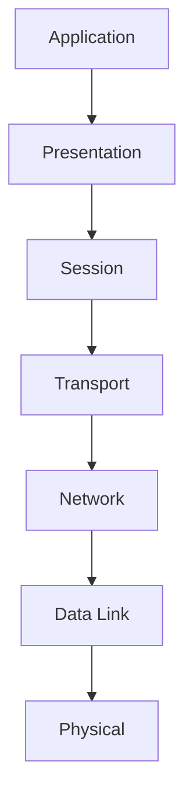

# Network Protocols

> Network protocol is a collection of rules that governs how data is transmitted, received, and interpreted between devices on a network, regardless of their internal structure or design.

## Key Points

- Defines what, how, and when data is communicated.
- Enables communication between heterogeneous devices.
- Ensures reliable and standardized data exchange.
- Prevents data loss, duplication, and misinterpretation.

---

# Message Encoding

Communication process showing how data is encoded, transmitted, and decoded using network protocols.

## Diagram

---

# Working of Network Protocols

Network protocols work by dividing communication tasks into layers, where each layer performs a specific function to ensure successful data transmission.

- Communication is based on the OSI model, which consists of 7 layers.
- Each OSI layer uses specific protocols to perform its task.
- Data moves layer by layer from sender to receiver.
- Example: Internet Protocol (IP) operates at the Network Layer and handles routing using source and destination addresses.
- Layered communication improves reliability, scalability, and troubleshooting.

## OSI Model

## Links

- [[IP Address]]
- [[Ports in Networking]]
- [[Top 50 Ports and Protocols]]