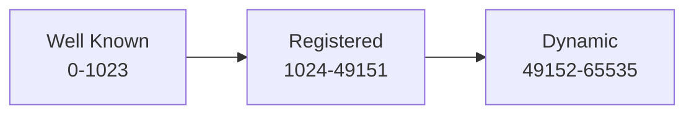
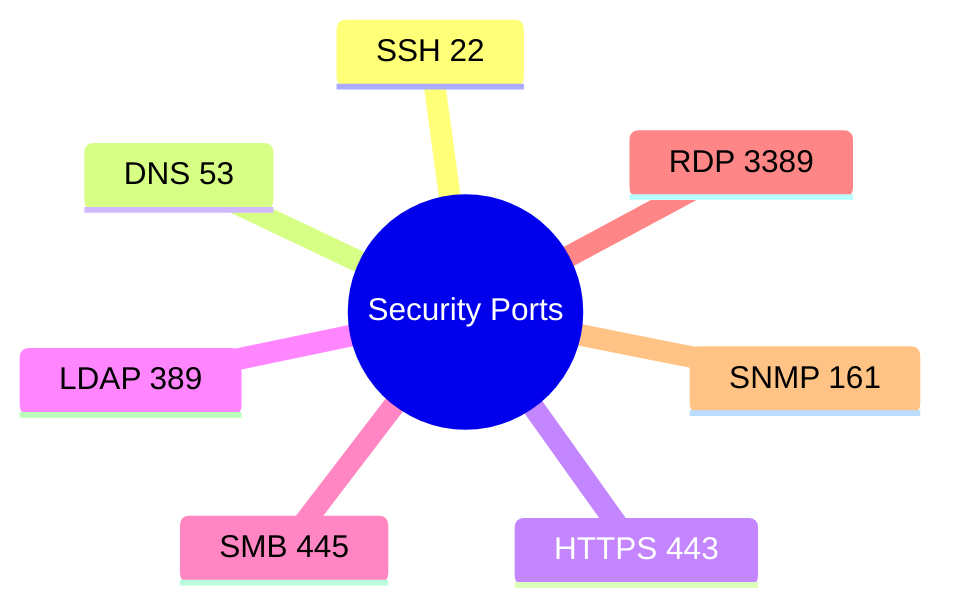

# Top 50 Ports and Protocols

## Common Ports Table

| Port....................... | Protocol..................... | Service............................................. |
| --------------------------- | ----------------------------- | ---------------------------------------------------- |
| 20                          | TCP                           | FTP Data                                             |
| 21                          | TCP                           | FTP Control                                          |
| 22                          | TCP                           | SSH                                                  |
| 23                          | TCP                           | Telnet                                               |
| 25                          | TCP                           | SMTP                                                 |
| 53                          | TCP/UDP                       | DNS                                                  |
| 67                          | UDP                           | DHCP Server                                          |
| 68                          | UDP                           | DHCP Client                                          |
| 69                          | UDP                           | TFTP                                                 |
| 80                          | TCP                           | HTTP                                                 |
| 88                          | TCP/UDP                       | Kerberos                                             |
| 110                         | TCP                           | POP3                                                 |
| 123                         | UDP                           | NTP                                                  |
| 135                         | TCP                           | RPC                                                  |
| 137                         | UDP                           | NetBIOS Name                                         |
| 138                         | UDP                           | NetBIOS Datagram                                     |
| 139                         | TCP                           | NetBIOS Session                                      |
| 143                         | TCP                           | IMAP                                                 |
| 161                         | UDP                           | SNMP                                                 |
| 162                         | UDP                           | SNMP Trap                                            |
| 179                         | TCP                           | BGP                                                  |
| 389                         | TCP/UDP                       | LDAP                                                 |
| 443                         | TCP                           | HTTPS                                                |
| 445                         | TCP                           | SMB                                                  |
| 465                         | TCP                           | SMTPS                                                |
| 514                         | UDP                           | Syslog                                               |
| 520                         | UDP                           | RIP                                                  |
| 587                         | TCP                           | SMTP Submission                                      |
| 636                         | TCP                           | LDAPS                                                |
| 853                         | TCP                           | DNS over TLS                                         |
| 989                         | TCP                           | FTPS Data                                            |
| 990                         | TCP                           | FTPS Control                                         |
| 993                         | TCP                           | IMAPS                                                |
| 995                         | TCP                           | POP3S                                                |
| 1433                        | TCP                           | MS SQL                                               |
| 1521                        | TCP                           | Oracle DB                                            |
| 1723                        | TCP                           | PPTP                                                 |
| 1812                        | UDP                           | RADIUS Authentication                                |
| 1813                        | UDP                           | RADIUS Accounting                                    |
| 2049                        | TCP/UDP                       | NFS                                                  |
| 3306                        | TCP                           | MySQL                                                |
| 3389                        | TCP                           | RDP                                                  |
| 5432                        | TCP                           | PostgreSQL                                           |
| 5900                        | TCP                           | VNC                                                  |
| 8080                        | TCP                           | Alternative HTTP                                     |

---

# Port Categories

---

# Security Relevant Ports

